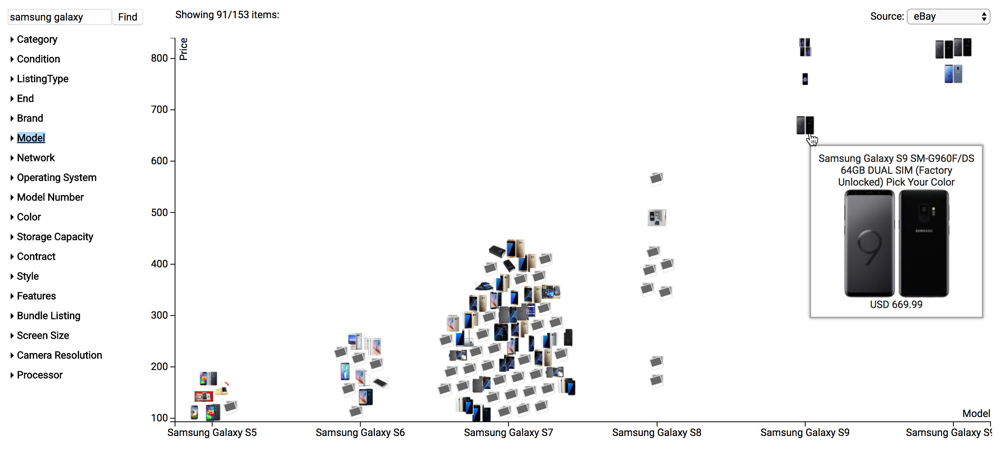

Papershop
=========

A web app to gather items for sale from various web shops and display
them together in one plot so you can easily compare prices.

Web shops share a similar data model:
Items with a price and some features that can be searched by a keyword.
That's the case for things like:
- E-commerce: ebay.com, amazon.com, mercadolivre.com.br
- Classified ads: gumtree.com, marktplaats.nl, olx.com.br
- Hotel booking: booking.com, hostelworld.com
- Apartment renting: funda.nl, kamernet.nl

Maybe in an ideal world you'd have one fancy UI to do your browsing
and all the shops would just publish data that you can visualize there.
That's the idea.

You can try it [here](http://vitobasso.github.io/papershop-web/web/).  
Note 1: Currently Chrome will complain of "unsafe scripts" (sorry) so,
if you're not paranoid, you need to **click the shield** in the right end of
the address bar in the browser (or the padlock in Firefox).
You can check index.html to see what scripts are being loaded.  
Note 2: It will only fetch data from public apis (approach 1), so it's
limited to those 2 websites.

## Data scraping

### Approach 1: Call public apis
Can't really do it for multiple websites, but as a first attempt I did it for:
- [✔] ebay.com
- [✔] mercadolivre.com.br

### Approach 2: Scrape HTML from their website
Easy to add new websites once a common mapping mechanism has been defined.
Most websites have:
- A page with a **keyword search** box
- A results page showing a **list of items** and maybe paging buttons
- An **item details** page after clicking an item from the list

I've implemented this as a backend service in
[papershop-scraper](https://github.com/vitobasso/papershop-scraper)
and added mappings for some websites.
